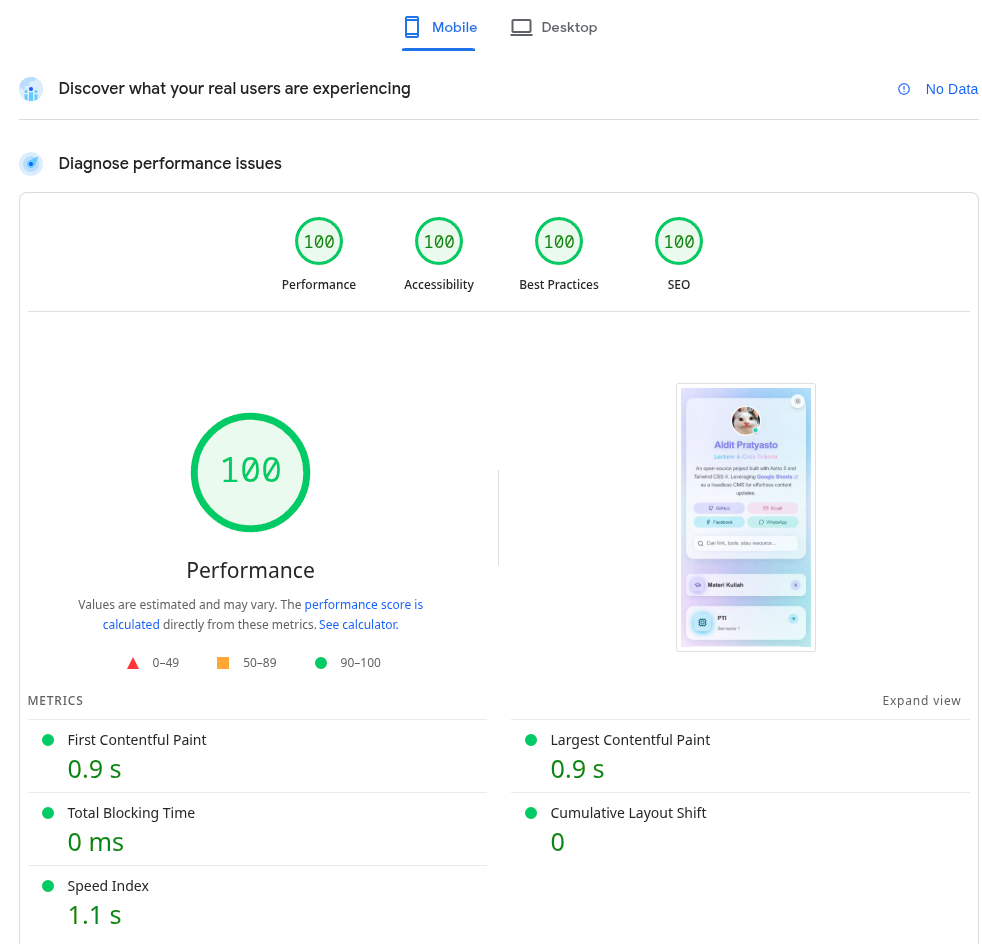
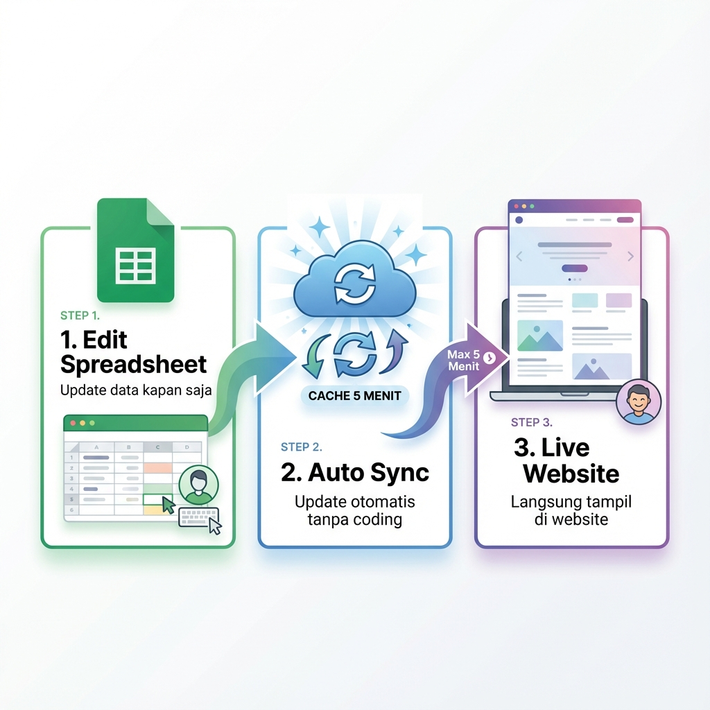

# 🌐 alditpra - My Personal Link Directory

> A modern, high-performance personal link directory built with Astro and Tailwind CSS 4, powered by Google Sheets as a free CMS. **100% free solution, no paid services required.**

[](https://astro.build)
[](https://vercel.com/new)

## ⚡ Performance First



> Achieving **100/100** across Performance, Accessibility, Best Practices, and SEO on mobile!

## ✨ Features

- 🎨 **Modern Design** - Glassmorphism UI with candy color palette
- 🌗 **Dark Mode** - Smooth theme toggle
- 📊 **Google Sheets as CMS** - Manage content without databases
- 🔍 **Real-time Search** - Instant filtering
- 📱 **Fully Responsive** - Works perfectly on all devices
- 🧙 **SANTET Generator** - AI prompt generator for academic assignments
- 🎰 **SLOT** - Student randomizer for Q&A sessions
- 🧹 **TUMBAL** - Metadata cleaner for lab reports
- 🔄 **Auto Data Refresh** - Changes appear in minutes

## 🔄 How It Works



## 🛠️ Tech Stack

- **Framework**: [Astro](https://astro.build)
- **Styling**: [Tailwind CSS](https://tailwindcss.com)
- **Data**: Google Sheets
- **Deployment**: [Vercel](https://vercel.com)

## 🚀 Getting Started

### Prerequisites

- Node.js 18+ (recommended: 22)
- npm or pnpm

### Installation

1. **Clone repository**
   ```bash
   git clone https://github.com/alditpra/alditpra.git
   cd alditpra
   ```

2. **Install dependencies**
   ```bash
   npm install
   ```

3. **Setup Google Sheets** (Optional - use your own data)
   
   a. Create a Google Spreadsheet with 3 sheets:
   - `Links` - Main link data (Home sheet)
   - `Level1` - Detail page content
   - `Categories` - Category definitions
   
   b. Publish spreadsheet to web:
   - File → Share → Publish to web
   - Select each sheet individually and choose "CSV"
   - Copy the published URLs
   
   c. Update `src/lib/constants.ts`:
   ```typescript
   export const SHEET_URLS = {
       links: "YOUR_LINKS_SHEET_URL",
       level1: "YOUR_LEVEL1_SHEET_URL",
       categories: "YOUR_CATEGORIES_SHEET_URL",
   };
   ```

4. **Run development server**
   ```bash
   npm run dev
   ```
   
   Open `http://localhost:4321`

## 📊 Data Structure

Just 3 simple sheets to manage your content:

### 1. Links (Home)
Main links displayed on the homepage.
- **Columns**: `id`, `name`, `description`, `link`, `category`, `icon`

### 2. Level1 (Details)
Content for detail pages (when a link doesn't go to an external site).
- **Columns**: `link_id`, `title`, `description`, `link`, `type`, `icon`
- *Note: `link_id` must match the `id` from the Links sheet.*

### 3. Categories
Define the sections on your homepage.
- **Columns**: `id`, `title`, `description`, `icon`

*No technical columns like `order` or `active` needed—everything is automatic!*

## 🎨 Customization

### Colors
Edit the candy color palette in `src/styles/global.css`:
```css
:root {
  --candy-teal: #35e2c3;
  --candy-blue: #14d0f0;
  --candy-purple: #7f73ff;
  --candy-lime: #A3E635;
}
```

### Site Configuration
Edit site information in `src/lib/constants.ts`:
```typescript
export const SITE_CONFIG = {
    name: "Your Name",
    description: "Your description",
    tagline: "Your tagline",
    author: "Your Name",
};
```

### Profile Avatar
Replace `public/avatar-desktop.webp` (desktop) and `public/avatar-mobile.webp` (mobile) with your own images.
- **Desktop**: ~208x208px circle
- **Mobile**: ~308x308px circle
- **Format**: WebP recommended

## 📦 Build & Deployment

### Build for Production
```bash
npm run build
```

### Deploy to Vercel

1. **Via Vercel CLI**
   ```bash
   npm i -g vercel
   vercel
   ```

2. **Via GitHub (Recommended)**
   - Push code to GitHub
   - Import project in [Vercel Dashboard](https://vercel.com/new)
   - Automatic deployments on every push

### Environment Variables
No environment variables required! All configuration is in `constants.ts`.

##  Auto Data Updates

The site uses **Incremental Static Regeneration (ISR)** with 5-minute cache expiration:
- Update Google Sheets → Changes appear within 5 minutes
- No manual redeployment needed
- Development mode skips cache for instant updates
- Optimal balance between freshness and performance

## 🧙 SANTET Generator

**S**enjata **AN**ti **T**Elat **T**ugas - AI prompt generator for academic assignments.

Features:
- Individual & Group assignment modes
- Dynamic form fields based on assignment type
- Real-time prompt preview
- Copy to clipboard functionality
- Hallucination warning for AI-generated content

Access at: `/santet`

## 🎰 SLOT Randomizer

**S**aatnya **LO**tre **T**anya - A fun tool for Q&A sessions.

Features:
- 🎲 **Random Picker** - Fairly select students for questions
- 📂 **Input Modes** - Manual entry or CSV upload
- ⚡ **Interactive UI** - Wheel animation and sound effects
- 📝 **History** - Track who has been called

Access at: `/slot`

## 🧹 TUMBAL Tool

**T**ools **U**bah **M**etadata **B**uat **A**nak **L**aprak - File metadata cleaner/editor.

Features:
- 🕵️ **Metadata Converter** - Change file creation/modification dates
- 📱 **Device Spoofing** - Make files look like they were created on mobile
- 🖼️ **Preview** - Check file properties before downloading
- 📂 **Bulk Processing** - Handle multiple files

Access at: `/tumbal`

## 🤝 Contributing

Contributions are welcome! If you find a bug or want to add features:

1. Fork the repository
2. Create feature branch (`git checkout -b feature/AmazingFeature`)
3. Commit changes (`git commit -m 'Add some AmazingFeature'`)
4. Push to branch (`git push origin feature/AmazingFeature`)
5. Open a Pull Request

## 📝 License

This project is open source and available under the [MIT License](LICENSE).

## 👨‍💻 Author

**Aldit Pratyasto**

- Website: [alditpra.vercel.app](https://alditpra.vercel.app)
- GitHub: [@alditpra](https://github.com/alditpra)

## 🙏 Acknowledgments

- [Astro](https://astro.build) - Amazing framework for content-focused sites
- [Tailwind CSS](https://tailwindcss.com) - Utility-first CSS framework
- [Lucide](https://lucide.dev) - Beautiful, consistent icon set
- [Vercel](https://vercel.com) - Free hosting with ISR support
- [Google Sheets](https://sheets.google.com) - Free CMS solution

---npm

<div align="center">

**⭐ Star this repo if you find it helpful!**

Made with ☕ by alditpra

</div>
